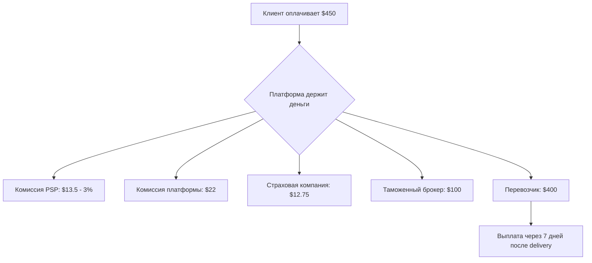

# Vector Express - Полный План Продуктового Флоу и Монетизации

> **Версия:** 1.0
> **Дата:** 13 декабря 2025
> **Рынок:** Казахстан, СНГ, Международный

---

## 📋 Содержание

1. [Обзор Продукта](#1-обзор-продукта)
2. [Полный Флоу Заказа](#2-полный-флоу-заказа)
3. [Система Оплаты](#3-система-оплаты)
4. [Монетизация и Распределение Денег](#4-монетизация-и-распределение-денег)
5. [Сравнение с Аналогами](#5-сравнение-с-аналогами)
6. [Юридические Особенности](#6-юридические-особенности)
7. [Технические Детали](#7-технические-детали)
8. [Дорожная Карта](#8-дорожная-карта)

---

## 1. Обзор Продукта

### 1.1 Что Такое Vector Express?

**Vector Express** — это **метасёрч-платформа для грузоперевозок**, которая агрегирует котировки от множества логистических компаний и позволяет клиентам:
- Сравнить цены и сроки доставки
- Выбрать лучшее предложение
- Оформить заказ онлайн
- Отслеживать груз в реальном времени

### 1.2 Целевая Аудитория

| Сегмент | Описание | Потребности |
|---------|----------|-------------|
| **SMB (Малый и средний бизнес)** | Онлайн-магазины, производители, импортёры | Низкие цены, прозрачность, простота |
| **E-commerce** | Продавцы Kaspi, Wildberries, Ozon | Массовая доставка, автоматизация |
| **Корпоративные клиенты** | Крупные компании с регулярными отправками | Договорные цены, персональный менеджер |
| **Перевозчики** | Логистические компании, экспедиторы | Доступ к клиентам, автоматизация |

### 1.3 Конкурентные Преимущества

✅ **Для Казахстана:**
- Kaspi.kz интеграция (75% населения использует)
- Поддержка казахского и русского языков
- Знание местной таможни и законодательства
- Фокус на China-Kazakhstan коридоре (Khorgos/Alashankou)

✅ **Технологии:**
- Прозрачная система котировок
- Автоматизированная обработка документов
- Рейтинг и верификация перевозчиков
- Мобильные приложения для клиентов и водителей

---

## 2. Полный Флоу Заказа

### 2.1 Этапы Пути Клиента


---

### 2.2 Детальный Флоу по Шагам

#### **ШАГ 1: Создание Отправления и Поиск Котировок**

**Пользователь вводит:**
- Откуда: город отправления + адрес (или самовывоз)
- Куда: город назначения + адрес (или до порта/терминала)
- Габариты груза: вес, объём, количество мест, размеры
- Тип груза: общий, хрупкий, опасный, скоропортящийся
- Дата забора: желаемая дата

**Система:**
1. Валидирует данные (проверка HS кодов, ограничений)
2. Отправляет запросы к API перевозчиков
3. Рассчитывает котировки от всех доступных carriers
4. Сохраняет Shipment в БД со статусом `draft`

**Результат:**
Страница с 3-10+ котировками от разных перевозчиков

---

#### **ШАГ 2: Сравнение Котировок**

**Отображается для каждой котировки:**

| Параметр | Пример |
|----------|--------|
| **Перевозчик** | Observer Logistics ⭐ 4.8 (156 отзывов) ✓ Верифицирован |
| **Тип сервиса** | Стандарт / Экспресс / Эконом |
| **Срок доставки** | 7-10 дней |
| **Цена** | $450 (включая 5% комиссию платформы) |
| **Что включено** | ✓ Забор от двери ✓ Доставка до двери ✓ Страховка $5000 |
| **Дополнительные услуги** | + Таможенное оформление $120 |
| **Рейтинг** | ⭐⭐⭐⭐⭐ 4.8/5 |

**Действия пользователя:**
- Сравнить по цене / сроку / рейтингу
- Посмотреть отзывы о перевозчике
- Добавить услуги (страховка, таможня)
- Кнопка **"Выбрать"** → переход к оформлению

---

#### **ШАГ 3: Оформление Заказа**

**На странице оформления клиент заполняет:**

**3.1 Контактная информация**
- Имя и телефон отправителя
- Имя и телефон получателя
- Email для уведомлений

**3.2 Адреса**
- Адрес забора (улица, дом, офис/склад, этаж)
- Адрес доставки
- Время работы (для координации с водителем)
- Особые инструкции (код домофона, контакт охраны)

**3.3 Детали груза**
- Описание содержимого (для таможни)
- Стоимость товара (для страховки и таможни)
- HS код товара (если известен, иначе помогает система)
- Упаковка: картон, палета, ящик, мешки

**3.4 Коммерческие документы**
- Коммерческий инвойс (может быть сгенерирован автоматически)
- Упаковочный лист
- Сертификат происхождения (если нужен)
- Другие документы

**3.5 Выбор способа оплаты**
- **Для Казахстана:** Kaspi.kz / Карта / Банковский перевод
- **Для СНГ:** Карта / Банковский перевод / Электронные кошельки
- **Для Мира:** Stripe / PayPal / Кредитная карта

**Действия системы:**
1. Валидация всех данных
2. Создание Order в БД со статусом `pending`
3. Генерация номера заказа: `VE-2025-001234`
4. Блокировка цены на 24 часа
5. Отправка summary клиенту

---

#### **ШАГ 4: Оплата**

**Типы оплаты в зависимости от клиента:**

| Тип клиента | Способ оплаты | Условия |
|-------------|---------------|---------|
| **Новый клиент** | Предоплата 100% | До начала перевозки |
| **Постоянный клиент (3+ заказа)** | Net 15 или 50% предоплата | В течение 15 дней |
| **Корпоративный (договор)** | Net 30 или по счёту | В течение 30 дней |

**Процесс оплаты:**

**4.1 Для предоплаты:**
```
Клиент выбирает способ
    ↓
Kaspi.kz: Переход на Kaspi Pay → QR код или номер телефона
Карта: Форма ввода карты (Cloudpayments/Stripe) → 3D Secure
Банк: Реквизиты для перевода + инструкции
    ↓
Система получает webhook от платёжного шлюза
    ↓
Статус Order меняется: pending → confirmed
    ↓
Уведомление клиенту: "Оплата получена, заказ подтверждён"
    ↓
Уведомление перевозчику: "Новый заказ VE-2025-001234"
```

**4.2 Для отсрочки платежа:**
```
Проверка кредитного лимита клиента
    ↓
Если одобрено: Order → confirmed, инвойс отправлен на email
    ↓
Клиент оплачивает в течение 15/30 дней
    ↓
Напоминания за 3 дня и в день срока
```

**Комиссии платформы:**
- Kaspi.kz: 1-2% (самый низкий для КЗ)
- Карты: 3% (Visa/MC/МИР)
- Stripe (международные): 2.9% + $0.30
- Банковский перевод: 0% (но медленно)

---

#### **ШАГ 5: Координация Забора Груза**

**Статус:** `confirmed` → `pickup_scheduled`

**Что происходит:**
1. **Платформа уведомляет перевозчика:**
   - Email + SMS + уведомление в приложении
   - Детали заказа, адрес, контакты

2. **Перевозчик назначает водителя:**
   - Через свою панель в Vector Express
   - Или через API из своей системы

3. **Система планирует забор:**
   - Водитель назначен на дату/время
   - Клиент получает SMS: "Забор запланирован на 15.12.2025 с 10:00 до 14:00"
   - Напоминание за 24 часа и за 2 часа

4. **Водитель связывается с отправителем:**
   - Подтверждает время
   - Уточняет детали (парковка, лифт, помощь с погрузкой)

---

#### **ШАГ 6: Забор Груза**

**Статус:** `pickup_scheduled` → `picked_up`

**В день забора:**
1. **Водитель приезжает на адрес**
2. **Проверка груза:**
   - Соответствие весу и габаритам
   - Состояние упаковки
   - Маркировка и этикетки
3. **Фото груза через приложение** (для доказательства состояния)
4. **Оформление накладной (CMR):**
   - Электронная подпись отправителя
   - Или бумажная CMR с фото
5. **Груз забран:**
   - Водитель отмечает в приложении → статус `picked_up`
   - Генерируется трекинг-номер: `VE-TRK-2025-001234`
   - Клиент получает SMS с ссылкой на отслеживание

**Документы после забора:**
- CMR (Consignment Note) — доступна в личном кабинете
- Фото груза
- Подтверждение забора с GPS координатами и временем

---

#### **ШАГ 7: Транспортировка**

**Статус:** `picked_up` → `in_transit`

**Этапы:**

**7.1 Груз на терминале/хабе отправителя**
- Сортировка
- Консолидация (если LTL — сборный груз)
- Погрузка в транспорт

**7.2 В пути**
- GPS-трекинг (если доступен)
- Обновления статуса на ключевых точках:
  - Покинул терминал Алматы
  - Прибыл на границу (Khorgos)
  - Пересёк границу
  - Прибыл на терминал в Урумчи

**7.3 Уведомления клиенту:**
- При каждом ключевом событии → email + SMS
- Если задержка → проактивное уведомление с причиной и новой ETA

**Пример timeline:**
```
День 1: Забор в Алматы
День 2: На терминале, консолидация
День 3-4: В пути до Khorgos
День 5: Прибытие на границу
День 6-7: Таможенная очистка (если нужно)
День 8: Пересечение границы, в пути в Китай
День 9-10: Прибытие на склад в Урумчи
```

---

#### **ШАГ 8: Таможенное Оформление (если международная)**

**Статус:** `in_transit` → `customs`

**Для Kazakhstan импорт/экспорт:**

**8.1 Предварительная подача документов:**
- За 3-5 дней до прибытия груза
- Таможенный брокер (партнёр Vector Express) подаёт:
  - Таможенную грузовую декларацию
  - Коммерческий инвойс
  - Packing list
  - Сертификат происхождения
  - Транспортная накладная

**8.2 Расчёт пошлин и налогов:**
```
Таможенная стоимость = стоимость товара + доставка + страховка
Пошлина = Таможенная стоимость × % ставки (0-30% в зависимости от HS кода)
НДС = (Таможенная стоимость + Пошлина) × 12%
Таможенный сбор = Таможенная стоимость × 1%
```

**8.3 Оплата пошлин:**
- Если DDP (предоплачено): клиент уже оплатил при бронировании
- Если DDU (не предоплачено): клиент получает счёт, оплачивает до выпуска груза

**8.4 Таможенная проверка:**
- Электронная декларация через "Astana-1"
- Физический досмотр (10-15% грузов)
- Если всё ОК: выпуск в течение 1-3 дней
- Если проблемы: запрос доп. документов, задержка

**8.5 Груз растаможен:**
- Статус → `customs_cleared`
- Клиент получает уведомление: "Груз прошёл таможню, скоро будет доставлен"

---

#### **ШАГ 9: Последняя Миля (Доставка)**

**Статус:** `customs_cleared` (или из `in_transit` если не было таможни) → `out_for_delivery`

**9.1 Груз на терминале назначения:**
- Урумчи / Алматы / Астана
- Сортировка для местной доставки

**9.2 Назначение курьера:**
- Последняя миля — обычно местный партнёр перевозчика
- Курьер получает маршрут на день (5-20 доставок)

**9.3 Уведомление клиенту:**
- SMS: "Ваш груз будет доставлен сегодня с 14:00 до 18:00"
- Номер телефона курьера для связи
- Возможность отследить курьера на карте (если GPS tracking)

**9.4 Доставка:**
- Курьер звонит за 30 минут до прибытия
- Доставка на адрес
- Проверка груза получателем
- Подпись/фото подтверждения доставки (POD — Proof of Delivery)

---

#### **ШАГ 10: Подтверждение Доставки**

**Статус:** `out_for_delivery` → `delivered`

**Что происходит:**
1. **Курьер отмечает доставку в приложении:**
   - Подпись получателя (электронная или фото подписи)
   - Фото доставленного груза
   - GPS координаты и время
   - Комментарии (если есть)

2. **Система фиксирует:**
   - Статус Order → `delivered`
   - Поле `delivered_at` → текущая дата/время
   - POD сохраняется в БД и доступен клиенту

3. **Уведомления:**
   - Клиенту (отправителю): "Груз доставлен получателю"
   - Получателю: "Спасибо за получение груза!"
   - Перевозчику: "Доставка VE-2025-001234 завершена"

4. **Запрос отзыва:**
   - Email через 2 часа после доставки
   - Просьба оценить перевозчика (1-5 звёзд)
   - Комментарий (опционально)

5. **Финальный инвойс:**
   - Если были доп. расходы (например, дополнительная услуга или превышение веса)
   - Инвойс отправляется клиенту
   - Для Net 30 клиентов: напоминание об оплате

6. **Расчёты с перевозчиком:**
   - Платформа переводит деньги перевозчику (97% от стоимости, 3% остаётся как комиссия)
   - Обычно Net 7 дней после доставки

---

### 2.3 Обработка Исключительных Ситуаций

#### **Отмена Заказа**

| Когда | Кто может | Условия возврата |
|-------|-----------|------------------|
| До забора | Клиент | Полный возврат минус комиссия шлюза (~3%) |
| После забора | Клиент | Возврат минус реальные затраты перевозчика |
| В любой момент | Админ | Решение в индивидуальном порядке |

**Процесс:**
1. Клиент нажимает "Отменить заказ"
2. Причина отмены (dropdown)
3. Если груз ещё не забран → автоматический возврат
4. Если груз уже в пути → запрос перевозчику, расчёт затрат, частичный возврат

---

#### **Задержка Доставки**

**Что делает система:**
1. Обнаруживает задержку (ETA прошла, статус не обновлён)
2. Автоматически запрашивает перевозчика о причине
3. Если ответа нет через 2 часа → эскалация менеджеру
4. Клиент получает проактивное уведомление:
   > "К сожалению, ваш груз задерживается. Новая дата доставки: 18.12.2025. Причина: таможенный досмотр. Приносим извинения."

5. Компенсация (опционально):
   - Для премиум-клиентов: скидка 10% на следующий заказ
   - Для критических задержек: частичный возврат

---

#### **Повреждение Груза**

**Процесс:**
1. Получатель отказывается принять груз или принимает с оговоркой
2. Курьер фотографирует повреждённый груз
3. Клиент подаёт претензию через платформу
4. Платформа открывает кейс:
   - Запрашивает фото с момента забора
   - Запрашивает объяснения у перевозчика
   - Проверяет страховку

5. Решение:
   - Если есть страховка: выплата от страховой компании
   - Если вина перевозчика: компенсация от перевозчика
   - Платформа выступает медиатором

---

## 3. Система Оплаты

### 3.1 Региональные Платёжные Методы

#### **🇰🇿 Казахстан**

| Метод | Доля рынка | Комиссия | Скорость | Приоритет |
|-------|------------|----------|----------|-----------|
| **Kaspi.kz** | 75% | 1-2% | Мгновенно | ⭐⭐⭐⭐⭐ Критично |
| Банковские карты | 60% | 3% | 1-3 мин | ⭐⭐⭐⭐ |
| Банковский перевод (ТТ) | 40% | 0% | 1-3 дня | ⭐⭐⭐ |
| Аккредитив (L/C) | <5% корпорат | Договорная | 5-10 дней | ⭐⭐ |
| Наличные (COD) | 10% | 0% | При доставке | ⭐ |

**Kaspi.kz интеграция:**
```javascript
// Через Kaspi Merchant API
POST /api/payment/kaspi/create
{
  "order_id": "VE-2025-001234",
  "amount": 150000, // KZT
  "currency": "KZT",
  "description": "Доставка груза Алматы-Урумчи",
  "customer_phone": "+77011234567"
}

Response:
{
  "payment_id": "kaspi_pm_xxx",
  "qr_code": "data:image/png;base64,iVBOR...",
  "deep_link": "kaspi.kz://pay?id=pm_xxx",
  "expires_at": "2025-12-15T18:00:00Z"
}
```

**Клиент:**
1. Сканирует QR код приложением Kaspi
2. Подтверждает оплату (FaceID/PIN)
3. Платформа получает webhook → Order confirmed

---

#### **🇷🇺🇧🇾🇦🇲 СНГ (Россия, Беларусь, Армения)**

| Метод | Комиссия | Особенности |
|-------|----------|-------------|
| **МИР карты** | 2.5% | Основная карточная система в РФ |
| **ЮMoney** (ex-Яндекс.Деньги) | 3% | Электронный кошелёк |
| **QIWI** | 3-4% | Популярен для частных лиц |
| **Банковский перевод** | 0% | Для юр. лиц, медленно |
| **Сбербанк Онлайн** | 2% | Интеграция через API |

**Валюта:** RUB (российский рубль), BYN (белорусский рубль)

---

#### **🌍 Международные (США, Европа, Азия)**

| Метод | Комиссия | Покрытие |
|-------|----------|----------|
| **Stripe** | 2.9% + $0.30 | 135+ стран, все валюты |
| **PayPal** | 3.4% + фикс. комиссия | Популярен в US/EU |
| **Visa/Mastercard** (напрямую) | 2.5-3.5% | Через Cloudpayments или Fondy |
| **Wire Transfer (SWIFT)** | $10-50 | Для крупных сумм >$10k |
| **Cryptocurrency** (будущее) | 1-2% | BTC, USDT для экспериментов |

**Валюты:** USD, EUR, GBP, CNY (юань)

---

### 3.2 Многовалютность

**Поддерживаемые валюты:**
- **KZT** (Казахстанский тенге) — основная для КЗ
- **USD** (Доллар США) — для международных
- **RUB** (Российский рубль) — для СНГ
- **EUR** (Евро) — опционально
- **CNY** (Китайский юань) — для China-KZ коридора

**Как работает:**
1. Цены в базе хранятся в USD (как стандарт)
2. При отображении конвертируются в валюту пользователя:
   ```javascript
   const userCurrency = user.country === 'KZ' ? 'KZT' :
                        user.country === 'RU' ? 'RUB' : 'USD'

   const exchangeRate = await getExchangeRate('USD', userCurrency)
   const localPrice = quote.price_usd * exchangeRate
   ```

3. Пользователь видит: **67 500 ₸** (KZT) или **$150** (USD)
4. Оплата происходит в выбранной валюте
5. Платформа конвертирует обратно в USD для отчётности

**API курсов валют:**
- Используем [exchangerate-api.com](https://exchangerate-api.com/) или Национальный Банк РК
- Обновление курсов каждый час
- Кэширование на 1 час

---

### 3.3 Модели Оплаты

#### **A. Предоплата (Prepaid) — По умолчанию**

**Для кого:** Новые клиенты, разовые отправки, e-commerce

**Процесс:**
```
Клиент выбирает котировку → Оформляет заказ → Оплачивает 100% →
Платформа подтверждает получение → Перевозчик начинает работу
```

**Преимущества:**
- ✅ Нет риска неплатежа
- ✅ Прозрачность для клиента
- ✅ Быстрый старт работы

**Недостатки:**
- ❌ Не все готовы платить до доставки
- ❌ Требует доверия к платформе

---

#### **B. Отсрочка Платежа (Net 15/30) — Для Постоянных Клиентов**

**Условия:**
- Минимум 3 успешных заказа на сумму >$500
- Проверка кредитной истории
- Лимит кредита: $5,000 - $50,000

**Процесс:**
```
Клиент выбирает котировку → Оформляет заказ → Система проверяет лимит →
Order подтверждён без оплаты → Инвойс отправлен → Груз доставлен →
Клиент оплачивает в течение 15/30 дней
```

**Контроль:**
- Автоматические напоминания за 3 дня до срока
- В день срока
- +3 дня просрочки → блокировка новых заказов
- +7 дней → передача в коллекторское агентство

---

#### **C. Частичная Предоплата (50/50)**

**Для кого:** Крупные заказы >$10,000, новые корпоративные клиенты

**Схема:**
- 50% при бронировании
- 50% после доставки (или перед доставкой, в зависимости от договора)

---

#### **D. DDP vs DDU (для международных)**

| Модель | Расшифровка | Кто платит пошлины | Когда использовать |
|--------|-------------|-------------------|-------------------|
| **DDP** | Delivered Duty Paid | Отправитель (всё включено в цену) | E-commerce, прозрачность для покупателя |
| **DDU** | Delivered Duty Unpaid | Получатель платит при получении | B2B, когда получатель хочет контроль |

**Рекомендация для Vector Express:**
- **DDP по умолчанию** — клиент видит финальную цену сразу
- DDU как опция для продвинутых пользователей

---

### 3.4 Безопасность Платежей

#### **PCI DSS Compliance**
- Платформа **НЕ хранит** данные карт
- Все карточные данные обрабатываются через сертифицированные PSP (Stripe, Cloudpayments)
- Токенизация для повторных платежей

#### **Fraud Detection**
- Проверка несовпадения IP / страны карты / адреса доставки
- Блокировка подозрительных транзакций (>$5000 от нового клиента)
- 3D Secure обязателен для карт

#### **Возвраты и Споры**
- Процесс chargeback через PSP
- Платформа предоставляет доказательства доставки (POD, трекинг)
- Win rate >85% для легитимных доставок

---

## 4. Монетизация и Распределение Денег

### 4.1 Откуда Приходят Деньги?

```
Клиент платит $450 за доставку груза Алматы → Урумчи
├─ Тариф перевозчика: $400
├─ Страховка: $15 (передаётся страховой компании)
├─ Таможенное оформление: $12 (передаётся брокеру)
└─ Комиссия платформы: $23 (5%)
```

---

### 4.2 Структура Комиссий

#### **Базовая Комиссия**

| Услуга | Ставка | Кто платит | Примечание |
|--------|--------|------------|------------|
| **Транспортировка** | 5% | Включено в цену для клиента | Основной доход |
| **Страхование** | 15% от премии | Клиент платит полную премию, платформа берёт 15% | Revenue share со страховой |
| **Таможенное оформление** | Фикс. $50-150 | Клиент | Передаём брокеру, оставляем $20-30 |
| **Дополнительные услуги** | 10-20% | Клиент | Упаковка, забор в нестандартное время |

**Пример расчёта:**
```python
order_total = $450
carrier_base_rate = $400
platform_commission_rate = 0.05  # 5%

platform_commission = carrier_base_rate * platform_commission_rate = $20
carrier_payout = carrier_base_rate = $400
insurance_premium = $15
insurance_revenue_share = $15 * 0.15 = $2.25

platform_total_revenue = platform_commission + insurance_revenue_share = $22.25
```

---

#### **Динамическая Комиссия (будущее)**

| Объём за месяц | Комиссия |
|----------------|----------|
| 1-10 заказов | 5% |
| 11-50 заказов | 4% |
| 51-100 заказов | 3.5% |
| 100+ заказов | Индивидуально (2-3%) |

**Цель:** Стимулировать крупных клиентов оставаться на платформе

---

### 4.3 Распределение Денег: Кто, Когда, Сколько?



**Timeline выплат:**

| Кому | Когда | Сумма | Метод |
|------|-------|-------|-------|
| **Payment Gateway** | Сразу при транзакции | 3% ($13.5) | Автоматически удерживается |
| **Страховая компания** | Сразу после booking | $12.75 | Bank transfer |
| **Таможенный брокер** | После растаможки | $100 | Bank transfer / Net 7 |
| **Перевозчик** | Net 7 после доставки | $400 | Bank transfer |
| **Платформа Vector Express** | Остаток | $22 - операционные расходы | - |

---

### 4.4 Модели Дохода

#### **1. Основной Доход: Комиссия с Транзакций**

**Прогноз на 2026 год:**
```
Средний чек: $300
Среднее количество заказов в месяц: 500
Комиссия платформы: 5%

Месячный доход = 500 × $300 × 0.05 = $7,500
Годовой доход = $7,500 × 12 = $90,000
```

**При масштабировании (3 года):**
```
2027: 2,000 заказов/месяц → $360k/год
2028: 5,000 заказов/месяц → $900k/год
2029: 10,000 заказов/месяц → $1.8M/год
```

---

#### **2. Дополнительные Источники Дохода**

| Источник | Модель | Потенциал |
|----------|--------|-----------|
| **Premium Listings для перевозчиков** | $200-500/месяц за топ позицию | $10k-30k/год |
| **SaaS-подписка для корпоративных клиентов** | $100-500/месяц за API доступ, аналитику, приоритетную поддержку | $50k-200k/год |
| **Финансовые услуги** | Факторинг, кредитование для SMB (комиссия 2-5%) | $100k-500k/год (через партнёров) |
| **Реклама и спонсорство** | Баннеры, промо для поставщиков упаковки, страховок | $20k-50k/год |
| **White-label решения** | Лицензирование платформы крупным логистическим компаниям | $50k-200k за установку + recurring fee |
| **Data & Analytics** | Продажа анонимизированных данных о тарифах, трендах | $30k-100k/год (через партнёров) |

---

### 4.5 Операционные Расходы

**Из комиссии $22 на заказ:**

| Статья расходов | Сумма | % |
|-----------------|-------|---|
| **Инфраструктура** (AWS, CDN, БД) | $2 | 9% |
| **Customer Support** (1 менеджер на 500 заказов) | $3 | 14% |
| **Маркетинг** (привлечение клиентов, SEO, реклама) | $5 | 23% |
| **Разработка** (поддержка, новые фичи) | $4 | 18% |
| **Юридические и бухгалтерия** | $1 | 5% |
| **Резерв на споры/возвраты** | $2 | 9% |
| **Чистая прибыль** | $5 | 23% |

**При 500 заказах/месяц:**
- Валовой доход: $11,000
- Операционные расходы: $8,500
- Чистая прибыль: $2,500/месяц ($30k/год)

**При масштабе 5,000 заказов/месяц:**
- Валовой доход: $110,000
- Операционные расходы: ~$65,000 (экономия на масштабе)
- Чистая прибыль: $45,000/месяц ($540k/год)

---

### 4.6 Стратегия Ценообразования

#### **Для Клиентов**

**Прозрачность:**
```
Тариф перевозчика: $400
+ Страховка ($5000 покрытие): $15
+ Таможенное оформление: $120
+ Комиссия платформы (5%): $22
────────────────────────
Итого к оплате: $557

В том числе НДС 12% (для КЗ): $67
```

**Скидки для частых клиентов:**
- 10 заказов/месяц → -5% комиссия
- 50 заказов/месяц → -10% комиссия + персональный менеджер

---

#### **Для Перевозчиков**

**Бесплатный доступ:**
- Регистрация бесплатно
- Первые 10 заказов бесплатно
- Затем комиссия 5% с каждого заказа

**Premium для перевозчиков ($300/месяц):**
- Топ позиция в результатах поиска
- Badge "Проверенный партнёр"
- Приоритетная поддержка
- API для интеграции
- Аналитика: конверсия, отзывы, сравнение с конкурентами

---

## 5. Сравнение с Аналогами

### 5.1 Глобальные Платформы

| Функция | **Vector Express** | Freightos | Flexport | Ship4wd |
|---------|-------------------|-----------|----------|---------|
| **Модель** | Metasearch | Metasearch → Full stack | Freight forwarder | Digital forwarder |
| **Комиссия** | 5% | 3-7% + SaaS fees | Markup 15-25% | Flat fee + % |
| **Способы оплаты** | Kaspi, Card, Wire | Card, Wire, Net 30 | Card, ACH, Net 30 | Card, ACH, Financing |
| **Кредитование** | Будущее (партнёры) | Visa integration 2025 | Working capital до $50M | Credit line $3M+ |
| **Страховка** | Опция 15% комиссия | Included/optional | Included | Optional |
| **Таможня** | Через партнёров | Да, automated | Да, full service | Да |
| **Трекинг** | Real-time GPS | Real-time | Real-time | Real-time |
| **Мобильное приложение** | В разработке | iOS/Android | iOS/Android | iOS/Android |

---

### 5.2 CIS/Казахстан Платформы

| Функция | **Vector Express** | ATI.su | Lardi-Trans | Della.kz |
|---------|-------------------|--------|-------------|----------|
| **Целевой рынок** | KZ, CIS, International | CIS (RU, KZ, BY) | CIS + Europe + China | KZ только |
| **Бизнес-модель** | Metasearch + commission | Freemium (Ads + Premium) | Subscription | Free exchange |
| **Комиссия** | 5% с заказа | Бесплатно (премиум features платно) | Subscription $20-100/мес | Бесплатно |
| **Количество грузов/день** | 50-200 (старт) | 150,000 | 40,000+ | ~1,000 |
| **Интеграции** | Kaspi, Stripe, API | Open API 2025 | API, TMS integration | Ограничено |
| **Язык** | RU, KK, EN | RU, EN | RU, UA, EN | RU, KK |
| **Тендеры/Аукционы** | Будущее | Да | Да | Нет |
| **Рейтинг перевозчиков** | Да | Да (с 1999 года) | Да | Базовый |
| **GPS трекинг** | Да | ATI Driver GPS app | GPS на карте | Нет |

**Ключевое отличие Vector Express:**
- 🎯 **Фокус на China-Kazakhstan коридор** (Khorgos, Belt & Road)
- 💳 **Kaspi.kz интеграция** (75% населения КЗ)
- 🌐 **Мультиязычность** (KK, RU, EN из коробки)
- 📱 **Современный UI/UX** (как Freightos, но для КЗ рынка)
- 🤖 **AI-powered** document processing (будущее)

---

## 6. Юридические Особенности

### 6.1 Казахстан

#### **Таможенное Законодательство**

**Основные документы:**
- Таможенный Кодекс ЕАЭС (действует с 2018)
- Закон РК "О таможенном деле"
- Национальный Банк РК: валютный контроль

**Ключевые требования:**
1. **Валютный паспорт сделки:**
   - Для экспорта/импорта >$50,000
   - Подаётся в банк в течение 15 дней
   - Отслеживание поступления валюты

2. **HS коды (12 цифр в GCC с 2025):**
   - Обязательны для всех товаров
   - Определяют ставку пошлины (0-30%+)
   - Ошибка = задержка на таможне

3. **Электронная декларация "Astana-1":**
   - Обязательна с 2018
   - Только через лицензированных таможенных брокеров
   - Иностранные компании не могут сами декларировать

4. **НДС 12%:**
   - Применяется к (стоимость товара + доставка + пошлина)
   - Можно возместить если компания — плательщик НДС

5. **Сроки:**
   - Предварительная декларация: за 3 дня до прибытия
   - Полная декларация: в течение 30 дней
   - Хранение на складе временного хранения: до 4 месяцев

**Проблемы для Vector Express:**
- ❌ Не можем быть таможенным брокером (нужна отдельная лицензия)
- ✅ **Решение:** Партнёрство с 2-3 лицензированными брокерами
- ✅ Берём комиссию за координацию ($20-50)

---

#### **Лицензирование**

| Деятельность | Нужна ли лицензия? | Комментарий |
|--------------|-------------------|-------------|
| **Freight forwarding** | Нет | Экспедирование не лицензируется в КЗ |
| **Таможенный брокер** | Да | Через партнёров |
| **Страхование** | Да | Через партнёров (Halyk, Nomad) |
| **Платёжная деятельность** | Нет | Используем лицензированные PSP |
| **Перевозка грузов** | Да (для самих перевозчиков) | Мы — платформа, не перевозчик |

**Итого:** Vector Express как платформа НЕ требует специальной лицензии, но должна работать с лицензированными партнёрами.

---

#### **Налогообложение**

**ТОО Vector Express KZ:**
```
Режим налогообложения: ОУР (Общеустановленный режим)
КПН (Корпоративный подоходный налог): 20%
НДС: 12% (обороты >30,000 МРП/год = ~$130k)
Социальный налог: 9.5% от ФОТ
```

**Пример:**
```
Годовой доход платформы: $500,000
- Операционные расходы: $350,000
- Прибыль до налогообложения: $150,000
- КПН 20%: $30,000
- Чистая прибыль: $120,000
```

**НДС:**
- Услуги платформы = услуга на территории КЗ → облагается НДС 12%
- Международная перевозка = экспорт услуг → НДС 0%
- **Решение:** Разделить в учёте внутренние и международные заказы

---

### 6.2 Россия (СНГ)

#### **Санкции и Ограничения (2025)**

**Проблемы:**
- ❌ Visa/Mastercard не работают для российских карт
- ❌ PayPal, Stripe недоступны из РФ
- ❌ SWIFT ограничен для некоторых банков

**Решения:**
- ✅ Использовать **МИР** (российская платёжная система)
- ✅ Интеграция с **ЮMoney, QIWI, Сбербанк Онлайн**
- ✅ Криптовалюта (USDT) для B2B (будущее)
- ✅ Банковский перевод через СБП (Система Быстрых Платежей)

**НДС в РФ:**
- 20% (выше чем в КЗ)
- Для экспедиторских услуг: НДС 0% если экспорт

---

### 6.3 Международные

#### **GDPR (Европа)**

**Если работаем с EU клиентами:**
- ✅ Privacy Policy на сайте
- ✅ Cookie consent
- ✅ Право на удаление данных ("Right to be forgotten")
- ✅ Data Processing Agreement с EU клиентами

---

#### **China**

**Для China-Kazakhstan коридора:**
- Партнёрство с китайскими freight forwarders
- Знание китайских таможенных процедур
- Интеграция с **WeChat Pay** (будущее)

---

## 7. Технические Детали

### 7.1 Архитектура Платежей

```
Frontend (Vue.js)
    ↓ (HTTPS)
Backend API (Laravel)
    ↓
Payment Service Layer
    ├─→ Kaspi.kz API (для КЗ)
    ├─→ Cloudpayments API (карты RU/KZ)
    ├─→ Stripe API (международные)
    └─→ Bank Transfer (реквизиты)

Webhook Handlers
    ↓
Order Status Update → confirmed
    ↓
Notification Service → Email/SMS клиенту и перевозчику
```

---

### 7.2 База Данных: Таблицы для Платежей

```sql
CREATE TABLE payments (
    id BIGINT PRIMARY KEY,
    order_id BIGINT NOT NULL,
    payment_method ENUM('kaspi', 'card', 'bank_transfer', 'cash'),
    payment_provider VARCHAR(50), -- 'kaspi', 'cloudpayments', 'stripe'
    amount DECIMAL(10,2),
    currency CHAR(3), -- 'USD', 'KZT', 'RUB'
    status ENUM('pending', 'processing', 'completed', 'failed', 'refunded'),
    provider_transaction_id VARCHAR(255),
    provider_response JSON, -- полный ответ от PSP
    paid_at TIMESTAMP NULL,
    refunded_at TIMESTAMP NULL,
    created_at TIMESTAMP,
    updated_at TIMESTAMP,

    FOREIGN KEY (order_id) REFERENCES orders(id)
);

CREATE TABLE payouts (
    id BIGINT PRIMARY KEY,
    carrier_id BIGINT NOT NULL,
    order_id BIGINT NOT NULL,
    amount DECIMAL(10,2),
    currency CHAR(3),
    status ENUM('pending', 'processing', 'completed', 'failed'),
    scheduled_at TIMESTAMP, -- Net 7 после delivery
    paid_at TIMESTAMP NULL,
    bank_account VARCHAR(255),
    payment_reference VARCHAR(100),
    created_at TIMESTAMP,

    FOREIGN KEY (carrier_id) REFERENCES carriers(id),
    FOREIGN KEY (order_id) REFERENCES orders(id)
);
```

---

### 7.3 Webhook Обработка

**Пример: Kaspi.kz Webhook**

```php
// backend/routes/api.php
Route::post('/webhooks/kaspi', [PaymentController::class, 'handleKaspiWebhook']);

// PaymentController.php
public function handleKaspiWebhook(Request $request)
{
    // Verify signature
    $signature = $request->header('X-Kaspi-Signature');
    if (!$this->verifyKaspiSignature($request->getContent(), $signature)) {
        return response()->json(['error' => 'Invalid signature'], 403);
    }

    $payload = $request->json()->all();
    $paymentId = $payload['payment_id'];
    $status = $payload['status']; // 'success' or 'failed'

    $payment = Payment::where('provider_transaction_id', $paymentId)->first();
    if (!$payment) {
        return response()->json(['error' => 'Payment not found'], 404);
    }

    if ($status === 'success') {
        $payment->status = 'completed';
        $payment->paid_at = now();
        $payment->save();

        $order = $payment->order;
        $order->status = 'confirmed';
        $order->save();

        // Send notification
        event(new OrderConfirmed($order));
    } else {
        $payment->status = 'failed';
        $payment->save();
    }

    return response()->json(['status' => 'ok']);
}
```

---

## 8. Дорожная Карта

### Фаза 1: MVP (Месяцы 1-3) ✅ СЕЙЧАС

- [x] Базовая функциональность (котировки, заказы, трекинг)
- [x] Интеграция с Observer Logistics
- [x] Админ-панель
- [x] Панель перевозчика
- [x] Мультиязычность (RU/KZ/EN)
- [ ] **Kaspi.kz интеграция**
- [ ] **Stripe интеграция**
- [ ] **Email/SMS уведомления**

**Приоритет сейчас:** Kaspi.kz + Stripe + Уведомления

---

### Фаза 2: Монетизация и Масштабирование (Месяцы 4-6)

- [ ] Платные подписки для перевозчиков (Premium listings)
- [ ] SaaS для корпоративных клиентов (API, аналитика)
- [ ] Партнёрство со страховыми компаниями
- [ ] Партнёрство с таможенными брокерами
- [ ] Рейтинг и отзывы о перевозчиках
- [ ] Система тендеров/аукционов
- [ ] Мобильное приложение (iOS/Android) MVP

**Цель:** Выход на $10k MRR

---

### Фаза 3: Расширение Функционала (Месяцы 7-12)

- [ ] AI-based document processing (автозаполнение инвойсов, HS кодов)
- [ ] Интеграция с ещё 5-10 перевозчиками
- [ ] Калькулятор маршрута с учётом границ, пошлин, времени
- [ ] Fleet management для перевозчиков
- [ ] Водительское приложение (GPS, proof of delivery)
- [ ] Instant translation в чате (RU ↔ KK ↔ EN)
- [ ] Финансовые услуги (факторинг для SMB через партнёров)

**Цель:** Выход на $50k MRR, 2,000 заказов/месяц

---

### Фаза 4: Международная Экспансия (Год 2+)

- [ ] Узбекистан, Кыргызстан, Азербайджан
- [ ] Турция-Казахстан коридор (Middle Corridor)
- [ ] Партнёрство с Alibaba/1688 для B2B China-KZ
- [ ] White-label решения для крупных компаний
- [ ] Blockchain для Bill of Lading
- [ ] Carbon footprint tracking (ESG тренд)

**Цель:** Стать #1 платформой для грузоперевозок в Центральной Азии

---

## 🎯 Заключение

Vector Express — это **прозрачная, технологичная, клиентоориентированная** платформа для грузоперевозок, которая:

✅ Решает проблему **непрозрачных цен** в логистике
✅ Упрощает **сложный процесс** международной доставки
✅ Даёт **доступ к множеству перевозчиков** через один интерфейс
✅ Специализируется на **Казахстане и СНГ** (China-KZ коридор)
✅ Монетизируется через **комиссию 5%** + доп. услуги
✅ Масштабируется до **$1M+ годового дохода** за 2-3 года

**Следующий шаг:** Реализация Kaspi.kz + Stripe интеграций → запуск бета-тестирования с 10 клиентами → сбор обратной связи → масштабирование.

---

**Конец документа**
